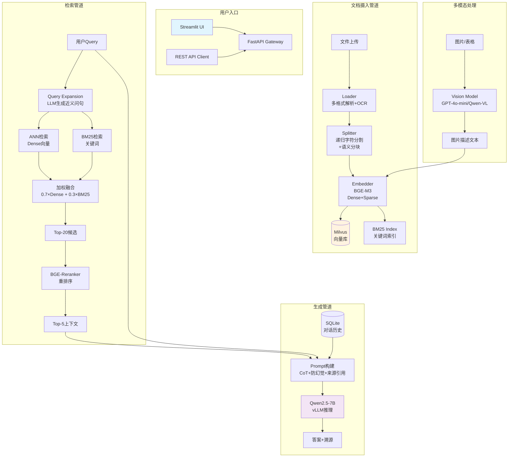

# Enterprise-RAG 技术设计文档

## 1. 技术栈选型理由

### 大语言模型：Qwen2.5-7B-Instruct
- **选择理由**：Qwen2.5-7B 在中文理解与生成任务上表现优异，7B 参数规模可在单张 A10/A100 GPU 上高效推理，适合企业私有化部署
- **备选方案**：DeepSeek-R1、ChatGLM3-6B（可通过 `config.yaml` 切换）

### 推理框架：vLLM
- **选择理由**：PagedAttention 显存管理、Continuous Batching、OpenAI 兼容 API
- **轻量替代**：llama.cpp + GGUF 量化，适合 CPU-only 或消费级 GPU 环境

### Embedding 模型：BAAI/bge-m3
- **选择理由**：支持稠密+稀疏向量统一输出，1024 维向量兼顾精度与效率，多语言支持
- **技术特性**：单模型同时输出 Dense Vector 和 Sparse Lexical Weights，天然支持混合检索

### 向量数据库：Milvus 2.4
- **选择理由**：支持十亿级向量检索、多种索引类型、完善的 Python SDK
- **轻量替代**：Chroma（零配置本地部署）/ Qdrant（Rust 高性能），修改 `config.yaml` 中 `vector_db.backend` 即可切换

### 文档解析：PyMuPDF + python-docx + openpyxl + pytesseract
- **选择理由**：PyMuPDF 解析 PDF 速度比 pdfplumber 快 4-10 倍，组合方案覆盖常见企业文档格式
- **OCR**：pytesseract 处理扫描件，多模态场景用视觉模型补充

### 检索策略：混合检索 + Reranker
- **混合检索**：Dense ANN (0.7) + BM25 Sparse (0.3) 加权融合，兼顾语义相似与关键词匹配
- **重排序**：BGE-Reranker-v2-m3 对 Top-20 候选精排，显著提升 Top-5 准确率

### 前端：Streamlit + FastAPI
- **Streamlit**：快速搭建 Demo，适合内部工具展示
- **FastAPI**：生产级异步 API，高性能并发，自动生成 OpenAPI 文档

---

## 2. 数据流架构图



---

## 3. 部署拓扑

### 单机部署（开发/测试环境）

```
┌─────────────────────────────────────────┐
│              单台 GPU 服务器              │
│  (A10-24G / A100-40G / RTX 4090-24G)   │
│                                          │
│  ┌──────────┐  ┌──────────┐             │
│  │  vLLM    │  │ Milvus   │             │
│  │ Qwen2.5  │  │Standalone│             │
│  │ :8000    │  │ :19530   │             │
│  └──────────┘  └──────────┘             │
│  ┌──────────┐  ┌──────────┐             │
│  │ FastAPI  │  │Streamlit │             │
│  │ :8080    │  │ :8501    │             │
│  └──────────┘  └──────────┘             │
│  ┌──────────────────────────┐           │
│  │  Embedding Service       │           │
│  │  BGE-M3 + BGE-Reranker   │           │
│  └──────────────────────────┘           │
└─────────────────────────────────────────┘
```

### 扩容建议
- **GPU 不足**：vLLM 可部署到独立 GPU 节点，或降级使用 llama.cpp CPU 推理
- **存储扩容**：Milvus 支持 MinIO/S3 分布式存储
- **高可用**：FastAPI 多实例 + Nginx 负载均衡

---

## 4. 模块职责

| 模块 | 文件 | 职责 |
|------|------|------|
| 文档加载 | `src/loader.py` | 多格式文档解析、OCR、多模态图片描述 |
| 文本分割 | `src/splitter.py` | 递归字符分割 + 语义分块 |
| 向量化 | `src/embedder.py` | BGE-M3 Dense + BM25 Sparse 索引 |
| 检索器 | `src/retriever.py` | 混合检索 + Reranker 重排序 |
| 生成器 | `src/generator.py` | LLM 提示词构建 + 答案生成 |
| 管道 | `src/pipeline.py` | 端到端 RAG 流程编排 |
| API | `api/main.py` | FastAPI 生产级 API |
| 前端 | `app.py` | Streamlit 演示界面 |
| 评测 | `evaluate.py` | Ragas 评测框架 |
